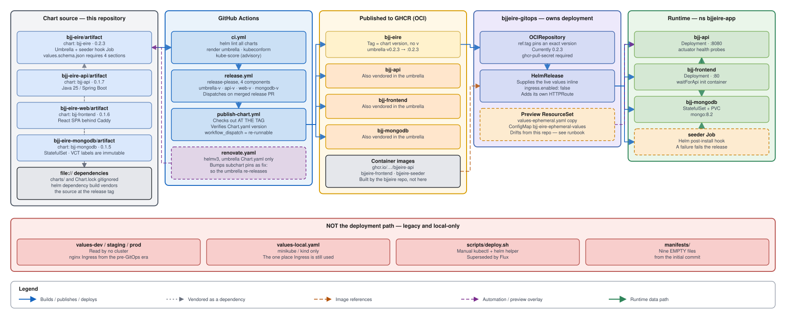

<div align="center">

# BJJ Éire — Helm Charts

**Helm charts for the BJJ Éire platform** — a React 19 SPA, a Java 25 / Spring Boot API, and MongoDB, delivered to AKS by Flux.

[](https://github.com/ianoflynnautomation/bjjeire-deploy/actions/workflows/ci.yml)
[](https://github.com/ianoflynnautomation/bjjeire-deploy/actions/workflows/release.yml)
[](LICENSE)
[](https://helm.sh)
[](https://openjdk.org)
[](https://react.dev)
[](https://www.mongodb.com)

</div>

---

## Overview

This repository **produces chart artifacts; it does not deploy them.** Charts
are published to GHCR as OCI artifacts, and [Flux](https://fluxcd.io) pulls
them from [`bjjeire-gitops`](https://github.com/ianoflynnautomation/bjjeire-gitops),
which owns the values each cluster actually runs.



## Documentation

| | |
|---|---|
| **[Architecture](docs/architecture.md)** | Chart composition, delivery chain, which values files are actually used |
| **[CI/CD](docs/ci-cd.md)** | CI, release-please, chart publishing, Renovate |
| **[Decisions (ADRs)](docs/adr/)** | Why the umbrella uses `file://` deps, why charts ship as OCI, why the seeder is a hook |
| **[Runbooks](docs/runbooks/)** | [Release a chart](docs/runbooks/release-a-chart.md) · [MongoDB recovery](docs/runbooks/mongodb-statefulset-recovery.md) · [Local install](docs/runbooks/local-install.md) |
| **[AGENTS.md](AGENTS.md)** | Conventions and hard rules — for coding agents and new contributors alike |

## Charts

Note that **directory names and chart names differ**:

| Directory | Chart | Version | Description |
|---|---|---|---|
| `bjj-eire/artifact` | `bjj-eire` | 0.2.3 | Umbrella, plus the seeder hook Job |
| `bjj-eire-api/artifact` | `bjj-api` | 0.1.7 | Java 25 / Spring Boot REST API |
| `bjj-eire-web/artifact` | `bjj-frontend` | 0.1.6 | React 19 SPA served by Caddy |
| `bjj-eire-mongodb/artifact` | `bjj-mongodb` | 0.1.5 | MongoDB 8.2 with persistent storage |

The umbrella depends on its siblings by `file://` path. `charts/` and
`Chart.lock` are gitignored build output — run `helm dependency build` after
cloning.

## How a change reaches a cluster

```
1. Merge a conventional commit touching the chart's directory
2. Merge the release PR  →  tag  →  publish-chart.yml  →  oci://ghcr.io/…:<version>
3. Bump the OCIRepository tag in bjjeire-gitops  →  Flux reconciles
```

Publishing a chart does **not** deploy it. Step 3 is required, and for a
subchart change the umbrella's dependency pin has to be bumped first. Full
procedure: [docs/runbooks/release-a-chart.md](docs/runbooks/release-a-chart.md).

The OCI tag is the chart version **without the `v`** — git tag
`umbrella-v0.2.3` publishes `bjj-eire:0.2.3`.

## Where values live

| File | Consumed by |
|---|---|
| `values.yaml` | Every render — chart defaults |
| `values-ephemeral.yaml` | Preview environments, via a copy in `bjjeire-gitops` |
| `values-local.yaml` | `helm install` on minikube / kind |
| `values-dev.yaml`, `values-staging.yaml`, `values-prod.yaml` | **Nothing — legacy** |

Deployed configuration lives in `bjjeire-gitops`, which supplies `values:`
inline in its `HelmRelease` and never reads the files here. The dev, staging,
and prod files are left over from the pre-GitOps era, when this repository
deployed with a kubeconfig and nginx Ingress — the clusters now run Istio
ambient with Gateway API. See
[ADR-0005](docs/adr/0005-environment-values-are-not-the-deployment-source.md).

## Local development

```bash
helm dependency build bjj-eire/artifact

MONGO_PW=$(echo -n 'change-me' | base64)

helm upgrade --install bjj-eire bjj-eire/artifact \
  --namespace bjjeire-app --create-namespace \
  -f bjj-eire/artifact/values.yaml \
  -f bjj-eire/artifact/values-local.yaml \
  --set "bjj-api.secrets.mongodbRootPassword.value=${MONGO_PW}" \
  --set "bjj-mongodb.secrets.mongodbRootPassword.value=${MONGO_PW}" \
  --wait --timeout 10m
```

Add `app.bjj.local` and `api.bjj.local` to `/etc/hosts`. Full walkthrough,
including building the images: [docs/runbooks/local-install.md](docs/runbooks/local-install.md).

## CI

Every pull request runs `helm lint` across all charts, renders the umbrella,
validates with `kubeconform` (default schemas plus the datree CRDs catalog),
and reviews the rendered workloads with `kube-score` (advisory).

Details: [docs/ci-cd.md](docs/ci-cd.md).

## Releases

[Release-Please](https://github.com/googleapis/release-please) manages four
independent release lines driven by
[Conventional Commits](https://www.conventionalcommits.org):

| Chart | Tag |
|---|---|
| Umbrella | `umbrella-v*` |
| API | `api-v*` |
| Frontend | `web-v*` |
| MongoDB | `mongodb-v*` |

Merging a release PR bumps the version, writes the changelog, tags, and
dispatches `publish-chart.yml`. **Never create a release tag by hand** —
[ADR-0004](docs/adr/0004-one-release-line-per-chart.md) explains what that
breaks.

## Related repositories

| Repository | Owns |
|---|---|
| **bjjeire-deploy** (this repo) | Helm charts and their OCI artifacts |
| [bjjeire](https://github.com/ianoflynnautomation/bjjeire) | Application code and the container images these charts reference |
| [bjjeire-gitops](https://github.com/ianoflynnautomation/bjjeire-gitops) | Flux resources; owns the live values and the chart version pin |
| [bjjeire-terraform-azurerm-aks](https://github.com/ianoflynnautomation/bjjeire-terraform-azurerm-aks) | Cluster, identities, Key Vault |

## Contributing

See [CONTRIBUTING.md](CONTRIBUTING.md). This project follows
[Conventional Commits](https://www.conventionalcommits.org) and the
[Contributor Covenant](CODE_OF_CONDUCT.md).

## Security

See [SECURITY.md](SECURITY.md) for the vulnerability disclosure policy.

## License

MIT © [Ian O'Flynn](https://github.com/ianoflynnautomation) — see [LICENSE](LICENSE).
