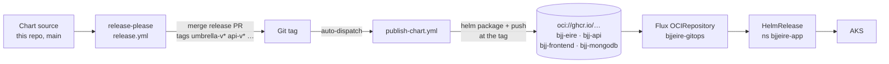

# Architecture

Helm charts for the BjjEire platform. This repository produces **OCI chart
artifacts**; it does not deploy them. Flux does, from `bjjeire-gitops`.

## Chart composition

One umbrella chart composes three subcharts. Note that the **directory names
and chart names differ** — the directory carries the `bjj-eire-` prefix, the
chart does not:

| Directory | Chart name | Version | Contents |
|---|---|---|---|
| `bjj-eire/artifact/` | `bjj-eire` | 0.2.3 | Umbrella + seeder Job |
| `bjj-eire-api/artifact/` | `bjj-api` | 0.1.7 | Java 25 / Spring Boot API |
| `bjj-eire-web/artifact/` | `bjj-frontend` | 0.1.6 | React SPA behind Caddy |
| `bjj-eire-mongodb/artifact/` | `bjj-mongodb` | 0.1.5 | MongoDB 8.2 |

`helm` sees chart names; `release-please`, `renovate`, and the publish workflow
see directories. Both appear throughout the tooling, and conflating them is the
most common source of confusion here.

### Dependencies are local paths

```yaml
# bjj-eire/artifact/Chart.yaml
dependencies:
  - name: bjj-mongodb
    version: "0.1.5"
    repository: "file://../../bjj-eire-mongodb/artifact"
    condition: bjj-mongodb.mongodb.enabled
  - name: bjj-api        # file://../../bjj-eire-api/artifact
  - name: bjj-frontend   # file://../../bjj-eire-web/artifact
```

`charts/*.tgz` and `Chart.lock` are **gitignored**. They are build output —
`helm dependency build` vendors whatever subchart source is committed at the
moment it runs. At release time that is the source at the release tag.

See [ADR-0001](adr/0001-umbrella-chart-with-local-path-dependencies.md).

## Delivery chain



The OCI tag is the **chart version without the `v`** — git tag `umbrella-v0.2.3`
publishes `oci://ghcr.io/ianoflynnautomation/bjj-eire:0.2.3`.

`bjjeire-gitops` currently pins the umbrella at `0.2.3` in
`kubernetes/apps/base/bjj-eire/app/ocirepository.yaml`, which matches
`.release-please-manifest.json`. Those two numbers moving apart is the failure
described in
[ADR-0004](adr/0004-one-release-line-per-chart.md).

## Values: what is actually used

This is the part most likely to mislead. The repository ships six values files;
**the deployed clusters use almost none of them.**

| File | Consumed by | Status |
|---|---|---|
| `values.yaml` | Every render — chart defaults | **Live** |
| `values-ephemeral.yaml` | Preview environments, via a copy in `bjjeire-gitops` | **Live** (see the drift warning below) |
| `values-local.yaml` | `helm install` on minikube / kind | Local only |
| `values-dev.yaml` | — | **Legacy** |
| `values-staging.yaml` | — | **Legacy** |
| `values-prod.yaml` | — | **Legacy** |
| `values-observability.yaml` | `observability/install.sh` | Standalone helper |

Dev, staging, and prod values are **not read by any cluster.** `bjjeire-gitops`
inlines its own `values:` block in the HelmRelease and never references these
files. They survive from the pre-GitOps era, when this repository deployed with
`helm upgrade` and a kubeconfig.

The clearest evidence: they configure an **nginx Ingress** with
`nginx.ingress.kubernetes.io/*` annotations on `api.dev.bjjeire.com` and
friends. The cluster runs Istio ambient with Gateway API — `bjjeire-gitops`
sets `ingress.enabled: false` for both api and frontend and supplies its own
`httproute.yaml`. There is no `kind: Ingress` anywhere in the GitOps repo.

The subcharts' `templates/ingress.yaml` are therefore dead in every deployed
environment. See [ADR-0005](adr/0005-environment-values-are-not-the-deployment-source.md).

### `values-ephemeral.yaml` exists twice and has drifted

The file here carries the comment *"This file is the source of truth; gitops
and tests copies must match it."* They do not match. The copy the cluster
actually uses is:

```
bjjeire-gitops/kubernetes/apps/base/bjj-eire-preview/controller/values-ephemeral.yaml
```

loaded as the `bjj-eire-ephemeral-values` ConfigMap via `configMapGenerator`.

Differences as of this writing — the GitOps copy is the one that runs:

| Setting | This repo | GitOps (live) |
|---|---|---|
| api / frontend `replicaCount` | 1 | 2 |
| api / frontend cpu requests | 100m | 50m |
| frontend `sysctls: net.ipv4.ip_unprivileged_port_start=0` | absent | **present** |
| `imagePullSecrets: ghcr-pull-secret` | absent | **present** |

The two functional ones matter: without the sysctl the Caddy frontend cannot
bind port 80 as a non-root user, and without the pull secret the private GHCR
images cannot be pulled. **Editing only this copy changes nothing.** See
[runbooks/sync-ephemeral-values.md](runbooks/sync-ephemeral-values.md).

## The seeder

The umbrella adds one template of its own: `templates/seeder-job.yaml`, a Helm
hook that loads seed data into MongoDB.

- `helm.sh/hook: {{ .Values.seeder.hookPolicy }}` — `post-install` by default
- `hook-weight: -5` for the ServiceAccount, `0` for the Job
- `hook-delete-policy: before-hook-creation,hook-succeeded`
- `restartPolicy: Never`, `backoffLimit: 1`

Default is `seeder.enabled: false`. Dev and ephemeral enable it with
`dataset: "test"`.

**A failing hook fails the release.** Because it is a hook rather than a plain
Job, a seeder that cannot run takes the whole HelmRelease down with it — which
is why it is disabled wherever a matching seeder image does not exist. See
[ADR-0003](adr/0003-seeder-runs-as-a-helm-hook.md).

## Schema validation

`values.schema.json` requires all four top-level keys — `bjj-mongodb`,
`bjj-api`, `bjj-frontend`, `seeder`. `helm template` and `helm install` enforce
it, so a values file that drops a section fails fast rather than rendering a
partial release.

## Repository boundaries

| Repository | Owns |
|---|---|
| **bjjeire-deploy** (this repo) | Helm charts and their OCI artifacts |
| [bjjeire](https://github.com/ianoflynnautomation/bjjeire) | Application code and the container images these charts reference |
| [bjjeire-gitops](https://github.com/ianoflynnautomation/bjjeire-gitops) | Flux resources that consume the charts; owns the live values |
| [bjjeire-terraform-azurerm-aks](https://github.com/ianoflynnautomation/bjjeire-terraform-azurerm-aks) | Cluster, identities, Key Vault |
| [bjjeire-ci-templates](https://github.com/ianoflynnautomation/bjjeire-ci-templates) | Reusable workflows this repo's CI calls |

A template change reaching production takes three steps: release a chart here,
bump the OCIRepository tag in `bjjeire-gitops`, let Flux reconcile.

## Dead weight

Two things in the tree are not used by anything:

- **`manifests/`** — nine **empty** files from the initial commit (2025-10-29),
  never touched since.
- **`scripts/deploy.sh`** — the manual `kubectl`/`helm upgrade` deploy helper
  from before GitOps. It still works against a local cluster, but it is not how
  any environment is deployed.

## Where to go next

- [ci-cd.md](ci-cd.md) — CI, release-please, and chart publishing
- [adr/](adr/) — why it is built this way
- [runbooks/](runbooks/) — releasing, rolling back, and the MongoDB recovery procedure
