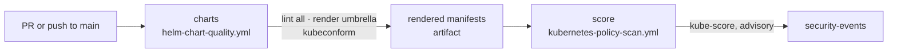
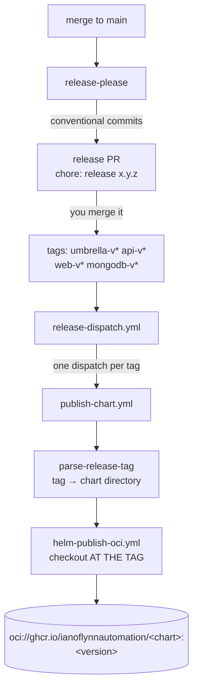

# CI/CD

Four workflows. All of the heavy lifting lives in reusable workflows from
[`bjjeire-ci-templates`](https://github.com/ianoflynnautomation/bjjeire-ci-templates),
referenced at `@v1`.

| Workflow | Trigger | Purpose |
|---|---|---|
| [`ci.yml`](../.github/workflows/ci.yml) | `pull_request` + `push` → `main` | Lint, render, schema-validate, policy scan |
| [`release.yml`](../.github/workflows/release.yml) | `push` → `main`, manual | release-please; dispatches publishing |
| [`publish-chart.yml`](../.github/workflows/publish-chart.yml) | `workflow_dispatch` | Package and push one chart to GHCR OCI |
| [`renovate.yaml`](../.github/workflows/renovate.yaml) | schedule | Dependency PRs |

## CI



`charts` runs `helm lint` across `chart-paths: "."`, then renders
`bjj-eire/artifact` into namespace `bjjeire-app` with:

```yaml
set-values: |
  bjj-api.api.image.tag=ci
  bjj-frontend.frontend.image.tag=ci
  seeder.enabled=false
```

The seeder is disabled for rendering because it is a Helm hook — see
[ADR-0003](adr/0003-seeder-runs-as-a-helm-hook.md).

Manifests are validated with `kubeconform` against the default schemas plus the
[datree CRDs catalog](https://github.com/datreeio/CRDs-catalog), which is what
lets CRD-typed resources validate without a live cluster.

`score` runs `kube-score` over the rendered output with
**`kube-score-enforce: false`** — advisory. Trivy, Polaris, and hadolint are
explicitly off in this repo.

Because CI renders the umbrella with `helm dependency build`, a subchart change
is exercised through the umbrella on every PR without needing a release.

## Releasing



Four independently versioned components, each with its own tag prefix and
changelog:

| Directory | Component | Tag | Release type |
|---|---|---|---|
| `bjj-eire/artifact` | `umbrella` | `umbrella-v${version}` | `helm` |
| `bjj-eire-api/artifact` | `api` | `api-v${version}` | `helm` |
| `bjj-eire-web/artifact` | `web` | `web-v${version}` | `helm` |
| `bjj-eire-mongodb/artifact` | `mongodb` | `mongodb-v${version}` | `helm` |

`bump-minor-pre-major` and `bump-patch-for-minor-pre-major` are both on, so
while charts are pre-1.0 a `feat:` bumps the patch and a breaking change bumps
the minor.

`publish-released` only runs when `releases-created == 'true'` — i.e. when a
release PR is **merged**, not on every push to main.

### Publishing checks out at the tag

`publish-chart.yml` passes `checkout-ref: ${{ inputs.tag }}` and
`expected-version` from the parsed tag. Two consequences:

- The published chart is the source **as of that tag**, including whichever
  subchart versions `helm dependency build` vendors at that commit.
- The version in `Chart.yaml` must match the tag, or the publish fails the
  `expected-version` check rather than pushing a mislabelled artifact.

It is `workflow_dispatch`, so you can **re-publish any tag by hand** — useful
when a push failed transiently. Pass e.g. `umbrella-v0.2.3`.

## Renovate

`enabledManagers: ["helmv3"]`, scoped to exactly one file:

```json
"helmv3": {
  "managerFilePatterns": ["/(^|/)bjj-eire/artifact/Chart\\.ya?ml$/"]
}
```

So Renovate's only job here is **bumping the umbrella's dependency pins** when a
subchart releases. It raises that as a `fix:` commit, which makes release-please
cut a new *umbrella* release, which republishes the umbrella chart Flux
consumes. Without that step a subchart release would never reach a cluster —
the umbrella still points at the old version.

Renovate needs `read:packages` on ghcr.io; the charts are private.

## After a release

Publishing to GHCR does **not** deploy anything. Flux pins an exact tag:

```yaml
# bjjeire-gitops/kubernetes/apps/base/bjj-eire/app/ocirepository.yaml
ref:
  tag: "0.2.3"
url: oci://ghcr.io/ianoflynnautomation/bjj-eire
```

Rolling out means bumping that tag in `bjjeire-gitops` and letting Flux
reconcile. See [runbooks/release-a-chart.md](runbooks/release-a-chart.md).

## Common failures

| Symptom | Cause |
|---|---|
| Publish fails on `expected-version` | `Chart.yaml` version and the git tag disagree |
| Release PR never appears | No conventional commit touched that component's directory since its last tag |
| Subchart released but nothing changed in-cluster | The umbrella's dependency pin was not bumped, or the GitOps OCIRepository tag was not moved |
| `helm dependency build` fails locally | A subchart version in `Chart.yaml` does not exist in the sibling directory |
| CI renders but the cluster disagrees | CI renders `values.yaml` only; the cluster's values live in `bjjeire-gitops` |
| HelmRelease upgrade stuck on MongoDB | StatefulSet `volumeClaimTemplates` immutability — [runbooks/mongodb-statefulset-recovery.md](runbooks/mongodb-statefulset-recovery.md) |
